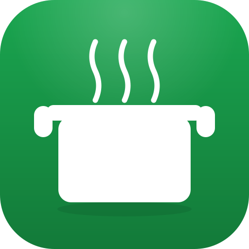
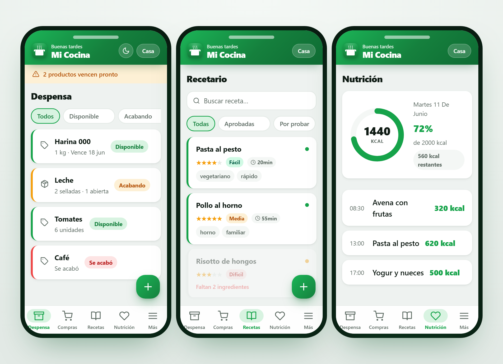

<div align="center">



# Mi Cocina

### Tu despensa, recetas y nutrición — **100 % en tu teléfono**, sin nube ni cuentas

[](https://github.com/johnvergel-dev/App-cocina/actions/workflows/ci.yml)
[](https://github.com/johnvergel-dev/App-cocina/releases/latest)
[](https://vuejs.org)
[](https://capacitorjs.com)
[](https://web.dev/progressive-web-apps/)
[](https://github.com/johnvergel-dev/App-cocina/releases/latest)
[](LICENSE)

<br/>

<picture>
  <source media="(prefers-color-scheme: dark)" srcset="docs/screenshot-dark.png" />
  
</picture>

</div>

---

> **Offline-first · Sin cuenta · Sin suscripción · Sin servidores · Costo \$0**

**Mi Cocina** gestiona tu despensa, lista de compras, recetario y nutrición diaria
funcionando **completamente sin conexión**. No hay backend, ni Firebase, ni APIs externas:
todos tus datos viven en tu propio dispositivo usando IndexedDB. Se instala como **APK
nativo en Android** (Capacitor) y como **PWA** desde cualquier navegador.

---

## ⬇️ Descargar

| Plataforma | Cómo |
|-----------|------|
| **Android** | Descarga el `MiCocina.apk` desde la **[última release](https://github.com/johnvergel-dev/App-cocina/releases/latest)** e instálalo (permite "orígenes desconocidos"). |
| **PWA / Navegador** | Abre la app publicada y usa **"Agregar a la pantalla de inicio"**. Funciona offline tras la primera carga. |

---

## ✨ Funcionalidades

### 🥫 Despensa
Productos con cantidad, unidad, foto y vencimiento. Modos **suelto/granel** y **multi-unidad**
(paquetes sellados + unidad abierta). Estados automáticos **Disponible · Acabando · Se acabó**,
escaneo de **código de barras** (BarcodeDetector nativo + ZXing de respaldo), foto comprimida a
≈ 20 KB y aviso local 3 días antes de vencer.

### 🛒 Compras
Se llena sola: al marcar un producto como *se acabó* aparece en la lista. Sugerencias de lo que
se está acabando, **swipe-to-delete** y limpieza de comprados de un toque.

### 📖 Recetario
Fichas con ingredientes, pasos, etiquetas, dificultad, tiempo, calorías y **foto del resultado**.
Ciclo de vida *por probar → aprobada / descartada* con estrellas. **Modo Cocina** que ilumina las
recetas según lo que tienes en la despensa, filtros avanzados (incluir/excluir ingredientes) y
descuento opcional de ingredientes al cocinar. Registra una receta como comida con un toque.

### 🥗 Nutrición & 📊 Métricas
Registro de comidas con un **anillo de progreso** animado y meta calórica diaria (celebración
háptica al alcanzarla). Gráfico de los últimos 7 días / 4 semanas, promedio kcal/día y días en meta.

### 📅 Planificador & 👤 Perfiles
Menú semanal desayuno/almuerzo/cena con autocompletado de recetas aprobadas e impresión a PDF.
Varios **perfiles** locales independientes, cada uno con su propia despensa, recetas y métricas.

### 💾 Copia de seguridad · 🌗 Modo oscuro
Exporta/importa **toda** tu información como un archivo JSON (combinar o reemplazar) para no perder
nada al cambiar de teléfono. Tema claro/oscuro persistente que respeta la preferencia del sistema.

---

## 🔒 Privacidad por diseño

Mi Cocina **no tiene servidores**. No se crea ninguna cuenta, no se envía telemetría y nada sale de
tu dispositivo. La única forma de mover tus datos es la copia de seguridad JSON que tú controlas.
El permiso de internet en Android solo existe por requisito del WebView; la app no lo usa para tus datos.

---

## 🛠 Stack

| Capa | Tecnología |
|------|-----------|
| UI | Vue 3 · Composition API · `<script setup>` |
| Build | Vite 8 (Rolldown) + `vite-plugin-pwa` (Workbox) |
| Móvil | Capacitor 8 — Android nativo |
| Datos | Dexie.js 4 sobre IndexedDB |
| Estado / Rutas | Pinia 3 · Vue Router 4 (hash) |
| Escaneo | BarcodeDetector API + `@zxing/library` |
| Nativo | Cámara, Hápticos, Notificaciones locales, Status bar |

**Sin backend. Sin Firebase. Sin APIs externas. Costo mensual: \$0.**

---

## 🚀 Desarrollo

```bash
# Requisitos: Node.js ≥ 18 (Android Studio solo para el APK)
cd cocina-app
npm install
npm run dev          # http://localhost:5173
```

```bash
npm run build        # PWA estática → dist/
npm run build:android# build + sincroniza el proyecto Android
npm run apk          # genera android/app/build/outputs/apk/debug/MiCocina.apk
```

> Los íconos (launcher, adaptativo, splash y PWA) se generan desde `public/icon.svg`
> con `node scripts/gen-icons.mjs` + `npx capacitor-assets generate --android`.
> El build de Android por CLI requiere JDK 17+ (p. ej. el JBR de Android Studio).

---

## 📁 Estructura

```
cocina-app/
├── src/
│   ├── components/   # AppIcon, BottomNav, BarcodeScanner, Toast, AnimatedNumber
│   ├── composables/  # useTheme, useHaptics, useNotifications, useImageCompressor, useBackup, useToast
│   ├── db/           # esquema Dexie (IndexedDB)
│   ├── stores/       # Pinia — profileStore
│   ├── views/        # Despensa, Compras, Recetario, Nutrición, Métricas, Planificador, Perfiles
│   ├── App.vue · main.js · style.css
├── assets/           # fuentes de íconos para @capacitor/assets
├── scripts/          # gen-icons.mjs
├── android/          # proyecto nativo (Capacitor)
└── public/           # íconos PWA + favicon
```

---

## 🗺 Roadmap

- [x] Copia de seguridad / restauración (JSON)
- [x] Foto del resultado en recetas
- [x] Registrar receta cocinada como comida
- [x] Ícono y splash de marca propios
- [ ] Compartir recetas como imagen o PDF
- [ ] Widget de Android en pantalla de inicio
- [ ] Soporte iOS (requiere Mac + Xcode)

---

## 🤝 Contribuir

Las contribuciones son bienvenidas — lee **[CONTRIBUTING.md](CONTRIBUTING.md)** y el
**[CHANGELOG.md](CHANGELOG.md)**. Abre un issue para discutir cambios grandes antes de un PR.

## 📄 Licencia

[MIT](LICENSE) © johnvergel-dev

---

<div align="center">

Hecho con ❤️ y mucho café por **[johnvergel-dev](https://github.com/johnvergel-dev)**

</div>
